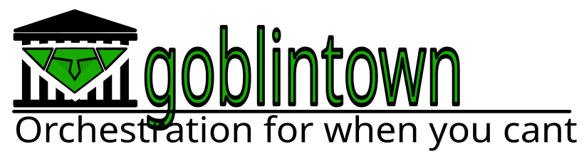

<p align="center">
  
</p>

# Goblintown (FLYTOWN baseline)

> **This repository is the FLYTOWN project's baseline.** FLYTOWN is a
> connectome-derived AI-orchestration research project; this baseline step is
> a stripped derivative of [Goblintown](https://github.com/0xbl33p/goblintown)
> (MIT licensed, copyright 0XBL33P — used here with the maintainer's explicit
> permission). The crypto/trading, voice, peer-to-peer social/federation, and
> Codex/ChatGPT-App/Vercel distribution bolt-ons have been removed; see
> [NOTICE.md](./NOTICE.md) for exactly what and why.
>
> **FLYTOWN status:** the connectome-derived planner is implemented as a
> swappable `PlannerBackend` (see below) with a full evaluation harness. The
> first falsification test — real FlyWire projectome vs. a label-shuffled
> copy — did **not** show the region-level wiring mattering; results and the
> reason are in [docs/flytown/experiments](./docs/flytown/experiments/README.md).

## FLYTOWN: connectome-derived planning

Goblintown's planner is one `PlannerBackend`; FLYTOWN adds others that
consume the same task signals and emit the same `Plan`:

| spec | what decides |
| --- | --- |
| `llm` | the conventional Goblintown planner (an LLM call) — always the fallback |
| `rules` | hand-written rules over task/repo signals |
| `random` | seeded random control |
| `learned` | small logistic router, trainable in the harness |
| `fly` | activation propagated through a real FlyWire connectome artifact, read out to actions |
| `fly:shuffled`, `fly:random_degree`, `fly:norecurrence`, `fly:signless`, `fly:ablate=MB_CA,EB`, `fly:learning` | null models and ablations of the same |

```bash
npm run build
node dist/cli.js fly planners                      # list backends
node dist/cli.js fly connectome                    # list connectome artifacts (built by connectome-etl/)
node dist/cli.js fly plan "<task>" --planner fly --dry-run   # decide + write a trace, run nothing
node dist/cli.js plan "<task>" --planner fly       # decide and execute with the real workers
node dist/cli.js fly trace <runId>                 # plain-text trace: signals → activity → action → plan
node dist/cli.js fly replay <runId>                # deterministic replay, diffs against the stored plan
node dist/cli.js fly eval --planners "rules,fly,fly:shuffled" --seeds 3 --epochs 8   # matched trials, mock worker world
```

Set `flytown.planner` in `.goblintown/warren.json` (or POST `{ planner }` to
`/api/plan`) to pick a backend; the LLM planner remains the fallback unless
`flytown.fallbackToLlm` is `false`. Traces are written to
`.flytown/traces/`. Connectome artifacts live under `connectome/` and are
produced by the Python sidecar in `connectome-etl/` (see its README); the
runtime has no Python dependency.

Every biologically-flavoured component is tagged `MEASURED`,
`INFERRED_FROM_LITERATURE`, `ENGINEERING_CHOICE` or `METAPHOR` in code and in
traces. Nothing here is, or claims to be, a mind.

Goblintown is a local-first, model-augmentable multi-agent orchestration
core. Start with a single fast answer, then summon the full **town** when the
work needs planning, memory, tools, debate, critique, and saved artifacts.

The core is a planning multi-agent orchestrator: **Single Goblin** mode
is one worker and one answer; **Goblintown** mode turns the prompt into a small
fleet of specialized creatures that decompose the task into a DAG, scavenge
context, race and debate, attack each other's outputs, spawn focused specialists
when the pack fails, and hand back a signed, content-addressed artifact that
future runs can build on.

## Install and run

```bash
npm install
npm run build
npm run dev          # runs the CLI directly from source with tsx
# or, after building:
npm start             # node dist/cli.js
npm run serve         # node dist/cli.js serve — opens the GUI at http://localhost:7777/
```

## Background

In April 2026, OpenAI published [*Where the goblins came from*](https://openai.com/index/where-the-goblins-came-from/),
explaining how a reward signal trained for a "Nerdy" personality leaked across
all of GPT-5.5's outputs and produced a noticeable surge in creature metaphors.
Codex shipped with a hardcoded ban list — *goblins, gremlins, raccoons, trolls,
ogres, pigeons*.

This project takes that ban list as a roster.

## Roster

| Creature | Job |
| --- | --- |
| **Goblin** | Worker. Cheap, high-temperature, dispatched in packs. Each pack member gets a different personality; an optional debate round lets them revise after seeing each other's proposals. |
| **Gremlin** | Adversarial. Tries to break each candidate output (per-goblin chaos pass). |
| **Raccoon** | Scavenger. Returns only the facts a task actually needs. Also loads relevant prior **Artifacts** when memory is enabled. |
| **Troll** | Reviewer. Default-rejects. Returns a JSON verdict. May invoke verifier tools (`json.parse`, `regex.match`, `http.head`) before scoring. |
| **Ogre** | Heavyweight. Deep reasoning, called only when the pack and the **Specialists** both fail. |
| **Pigeon** | **Scribe.** Distills each completed Rite into a typed Artifact (memory). |
| **Specialist Goblin** | A focused recovery worker spawned when the pack fails Troll review. Each one targets a single dominant failure mode identified by clustering the gremlin's critiques. |

A unit test pins the roster to the OpenAI ban list, so it can't drift quietly.
The Specialist is a Goblin variant — same kind, focused system prompt — so the
ban-list invariant still holds.

## Bestiary

<table>
<tr>
<td valign="top" align="center">

```
   ▄█▄        ▄█▄
   ███        ███
    ▀████████████▀
     █  ▀▄  ▄▀  █
     █   ●  ●   █
     █    ▾▾    █
     █▄▄▄▄▄▄▄▄▄▄█
      █▌ █  █ ▐█
      ▀▀ ▀  ▀ ▀▀
```

**Goblin**
</td>
<td valign="top" align="center">

```
   ▀▄ ▄▀ ▀▄ ▄▀
     ▀█▄▄█▄▄█▀
      █████████
      █ ◉   ◉ █
      █   ╳   █
      █ ╲╱╲╱╲ █
       ▀█████▀
         █ █
        ▀▀ ▀▀
```

**Gremlin**
</td>
<td valign="top" align="center">

```
    ▄█▄          ▄█▄
    ███          ███
     ▀████████████▀
     █▌ ●▔     ▔● ▐█
     █      ▾      █
     █▄▄▄▄▄▄▄▄▄▄▄▄█
     █▌█        █▐█
     ▀▀▀        ▀▀▀
```

**Raccoon**
</td>
</tr>
<tr>
<td valign="top" align="center">

```
       ▄ ▄    ▄ ▄
       █ █    █ █
     ▄████████████▄
     █  ●        ●  █
     █     ▾▾▾▾    █
     █  ──────────  █
     ████████████████
    █▌                ▐█
    █▌                ▐█
    ████          ████
```

**Troll**
</td>
<td valign="top" align="center">

```
        ▄▄▄▄▄▄▄▄▄▄
       ████████████
      ██  ▀▀    ▀▀  ██
      █     ●    ●    █
      █        ▽       █
      █▄  ▼▼▼▼▼▼▼▼  ▄█
       ████████████
      ██████████████
      ██          ██
      ██          ██
```

**Ogre**
</td>
<td valign="top" align="center">

```
       ▄██▄
      ██  ●█
      █▌    █▶▶▶
      ██████████
      █▀▀▀▀▀▀▀▀█
       ████████
          █ █
          █ █
         ▀▀ ▀▀
```

**Pigeon**
</td>
</tr>
</table>

## Pipeline (the Rite)

```
  optional ─────────────────────────────────────────────────────
  ┌──────────┐                                                 │
  │ Planner  │ DAG of sub-rites, recursive replan on failure   │
  └────┬─────┘                                                 │
       ▼                                                       │
  ┌──────────┐  facts +   ┌────────────┐  N parallel ┌──────────┐
  │ Raccoon  │  prior    ▶│  Goblin    │═════════════▶│ Goblins  │
  │ + memory │  artifacts │  pack      │  (per-goblin │  output  │
  └──────────┘            │ (varied   │  personality) └────┬─────┘
                          │  pers'ty) │                    │
                          └────────────┘                   │
                                  optional debate round    │
                                  (peers see peers'        │
                                   outputs, revise) ◀──────┘
                                          │
                                          ▼
                                  ┌─────────────┐
                                  │   Gremlin   │  per-goblin
                                  │ chaos pass  │  adversarial attack
                                  └──────┬──────┘
                                         ▼
                                  ┌─────────────┐  optional
                                  │    Troll    │  verifier tool-use
                                  │   review    │  (json/regex/http)
                                  └──────┬──────┘
                                         │
                              any pass ──┴── all fail
                                  │              │
                                  │              ▼
                                  │      ┌───────────────┐
                                  │      │ Cluster fails │  identify dominant
                                  │      │ (1 LLM call)  │  failure modes
                                  │      └───────┬───────┘
                                  │              ▼
                                  │      ┌───────────────┐
                                  │      │ Specialists   │  1-3 focused
                                  │      │ + re-judge    │  recovery workers
                                  │      └───────┬───────┘
                                  │              │
                                  │      passed/  │
                                  │      improved over seed
                                  │              ▼
                                  │      ┌────────────┐
                                  │      │   Ogre     │  last resort
                                  │      │  fallback  │  (heavyweight)
                                  │      └─────┬──────┘
                                  │            │
                                  ▼            ▼
                                 winner ◀──────┘
                                    │
                                    ▼
                              ┌─────────────┐
                              │  Pigeon —   │  distills the rite into
                              │   Scribe    │  a typed Artifact (memory)
                              └─────────────┘
```

Every step writes a Loot drop to the Hoard with parent links to its inputs.
A Rite is fully reconstructible from the Hoard alone. The Pigeon-Scribe also
emits a typed **Artifact** (claims, evidence, open questions, next steps) that
future rites can cite.

## Concepts

- **Loot** — one agent invocation, content-addressed by `sha256(model || prompt || output)`.
- **Quest** — lightweight: Goblin pack + Troll arbitration.
- **Rite** — full pipeline: Raccoon → pack → (debate?) → Gremlin → Troll → Specialists → Ogre fallback → Scribe.
- **Hoard** — file-backed store under `.goblintown/hoard/`.
- **Warren** — per-project root, found by walking up from cwd.
- **Shinies** — reward signal: troll score − cross-creature drift penalty + pass bonus, clamped 0..1.
- **Drift** — cross-creature word frequency. A Goblin output mentioning *raccoons* unprompted is the signal we measure.
- **Artifact** — a typed JSON summary of a completed Rite: claims, evidence, open questions, next steps, parent-artifact links. Stored under `.goblintown/hoard/artifacts/`. Future rites can cite a prior artifact or auto-load relevant ones.
- **Plan** — a DAG of sub-rites the Planner emits for complex tasks. Topologically executed; on a node failure the Planner can be re-invoked with the failure context (recursive replan, max depth 2).
- **Trace** — the full run history, exportable to the [LLM-MAS Orchestration Trace schema](https://github.com/xxzcc/awesome-llm-mas-rl) for compatibility with academic tooling.

## Using Goblintown

`goblintown serve` opens **Goblin Mode** at `/`: one prompt, a **Single
Goblin / Goblintown** mode switch, and a Tank checkbox.

- **Single Goblin** runs one worker for one answer — fast chat.
- **Goblintown** turns the prompt into a planner DAG with the full pack, memory,
  and self-correction, streaming progress as it goes.
- The **Tank** is a tamagotchi-style live diorama at `/tank`: each creature has
  a home, tokens stream into per-creature thinking bubbles, the DAG panel lights
  up node-by-node during a plan, and the result panel slides up with the winning
  output. Sprites are the default presentation, with emoji fallback when an asset
  is missing.

Everything else lives behind **Settings**: API provider and per-creature model
routing, imported context, cloud sign-in, and reset.

Run state is persisted to `.goblintown/runs/<runId>.json`, so an interrupted run
can be resumed from the Tank's recovery prompt after a restart.

### First run

On first launch, Goblin Mode asks two things: which **AI provider** should power
chat, and whether this Warren should **Stay Local** or **Use Goblintown Cloud**.
Both can be changed later from **Settings**.

Set a provider API key for any creature call. You can set it in your shell, or
save it from **Settings → API Provider** in the app. Local Ollama uses a
harmless dummy key if none is set; LM Studio needs `LM_API_TOKEN` only when its
server authentication is enabled.

### Command line

The same package still ships a CLI for development and automation — `goblintown
serve`, `init`, `rite`, `plan`, `quest`, `context`, `route`, and more. Run
`goblintown --help` for the full list.

## Capabilities

| Area | What it does |
| --- | --- |
| **Tank runtime** | Live creature diorama, default sprite sheets, centered wordmark, result panel, resumable runs, and reset. |
| **Memory** | Pigeon-Scribe distills every Rite into a typed Artifact (claims, evidence, open questions, next steps, parent links). Local context ingestion imports old conversations/projects; Chat Hoard Import Mode imports Codex and ChatGPT chats as pre-vectorized root/chunk memory. |
| **Planning** | Planner emits a typed DAG; the executor runs each node as a sub-rite, feeds artifacts forward, and replans after node failures. |
| **Specialist recovery** | Failed packs are clustered by dominant failure mode, then 1-3 focused Specialist Goblins repair the best seed before Ogre escalation. |
| **Debate** | Goblins can see peer proposals and revise once before Gremlin/Troll review. |
| **Verifier tools** | Troll can invoke `json.parse`, `regex.match`, and gated `http.head` before scoring. |
| **Provider routing** | OpenAI, OpenRouter, Ollama, LM Studio, Groq, Together, Mistral, DeepSeek, Anthropic, Gemini, and custom OpenAI-compatible endpoints, with per-creature routes. |
| **Goblintown Cloud** | Optional Firebase-backed SSO for cloud sign-in, while local rite/run files stay in `.goblintown/`. |
| **Trace & audit** | Run export to LLM-MAS trace schema, artifact lineage graphing, audit, compare, reroll, context search, and context folding. |

## Providers, local inference, and output formats

Goblintown talks to OpenAI by default, but the underlying client is just the
`openai` SDK pointed at a base URL — anything that exposes an OpenAI-compatible
API works. Choose a provider from **Settings → API Provider**; non-secret
settings are saved to `.goblintown/warren.json`, and API keys are never written
there.

| Preset | Base URL | Key env var |
| --- | --- | --- |
| OpenAI | default SDK URL | `OPENAI_API_KEY` |
| OpenRouter | `https://openrouter.ai/api/v1` | `OPENROUTER_API_KEY` |
| Ollama | `http://localhost:11434/v1` | `OLLAMA_API_KEY` (optional; dummy key if unset) |
| LM Studio | `http://localhost:1234/v1` | `LM_API_TOKEN` |
| Groq | `https://api.groq.com/openai/v1` | `GROQ_API_KEY` |
| Together AI | `https://api.together.ai/v1` | `TOGETHER_API_KEY` |
| Mistral | `https://api.mistral.ai/v1` | `MISTRAL_API_KEY` |
| DeepSeek | `https://api.deepseek.com` | `DEEPSEEK_API_KEY` |
| Anthropic | `https://api.anthropic.com/v1/` | `ANTHROPIC_API_KEY` |
| Gemini | `https://generativelanguage.googleapis.com/v1beta/openai/` | `GEMINI_API_KEY` |
| Custom | user supplied | user supplied |

Defaults: Goblin / Gremlin / Raccoon / Troll / Pigeon run on `gpt-5-mini`, Ogre
on `gpt-5`. Per-creature provider routes let you mix backends — e.g. cheap
local goblins with a hosted ogre. Output format can be `freeform`, `markdown`,
or `json`. `gpt-5*`, `o*`, `deepseek-r*`, and `-thinking` models are detected
and switched to reasoning-model parameters automatically.

## Goblintown Cloud

Goblintown is local by default. **Stay Local** keeps memory, runs, provider
secrets, and reset state on the machine. **Use Goblintown Cloud** signs in
through the bundled Firebase project for optional cloud sync, while local
rite/run files still remain in `.goblintown/`. Normal users do not need
Firebase keys; forks can override them via `FIREBASE_*` env vars.

## Building from source

```bash
npm install
npm run build
npm run serve -- --port 7777
```

Desktop packaging scripts (`npm run dist:mac`, `dist:win`, `dist:linux`,
`dist:desktop`) are still present for local Electron builds (output goes to
the gitignored `release/`), but this baseline does not ship any prebuilt
installers — there is no release pipeline wired up in this fork yet.

## Tests

```bash
npm test
```

The suite runs as pure functions with no OpenAI calls, covering drift, reward,
Hoard content-addressing, audit, planner DAG validation, debate prompt
construction, verifier tool dispatch, embeddings ranking, context folding,
provider routing, output formatting, cloud mode, sprite assets, trace export,
and the GUI/Settings wiring.

## Research foundations

Goblintown is an engineering project, not a research paper, but the
orchestration design is opinionated by what's working in current LLM multi-agent
systems. We deliberately stay in the **prompted, training-free** slice of the
literature so everything runs with just an OpenAI-compatible API key.

[1] **OpenAI**, *Where the goblins came from* (April 2026). The roster is taken
straight from the hardcoded ban list described in this postmortem.
<https://openai.com/index/where-the-goblins-came-from/>

[2] **Nielsen, S., et al.** *Learning to Orchestrate Agents in Natural Language
with the Conductor.* arXiv:2512.04388 (2025). *Dynamic topology selection* and
*recursive-self-as-worker* are borrowed as prompted heuristics in the Planner.

[3] **Zhou, & Chan.** *ADEMA: Knowledge-State Orchestration for Long-Horizon
Synthesis.* arXiv:2604.25849 (2026). The typed Artifact memory adapts ADEMA's
"epistemic bookkeeping."

[4] **Saeidi, et al.** *FAMA: Failure-Aware Meta-Agentic Framework.*
arXiv:2604.25135 (2026). The Specialist re-rite layer follows FAMA's pattern of
spawning a minimal specialist that targets the dominant error.

[5] **Parmar.** *MCP Workflow Engine: Separating Intelligence from Execution.*
arXiv:2605.00827 (2026). The plan-then-execute split comes from this paper.

[6] **Zou, J., et al.** *Latent Collaboration in Multi-Agent Systems.*
arXiv:2511.20639 (2025). The optional debate round is inspired by this
training-free latent-communication result.

[7] **Peng, Z., et al.** *CriticLean: Critic-Guided Reinforcement Learning for
Mathematical Formalization.* arXiv:2507.06181 (2025). The verifier-as-reward
pattern in the Troll's tool-use round comes from here.

[8] **xxzcc.** *Awesome LLM-MAS RL.* <https://github.com/xxzcc/awesome-llm-mas-rl>
(May 2026). The survey's five orchestration sub-decisions (spawn / delegate /
communicate / aggregate / stop) motivated the debate round, and its JSON trace
schema is adopted as Goblintown's `export-trace` output format.

## Citing

```bibtex
@software{goblintown,
  author  = {0XBL33P},
  title   = {Goblintown: a planning multi-agent orchestration protocol on top of OpenAI},
  year    = {2026},
  url     = {https://github.com/0xbl33p/goblintown}
}
```

## License

MIT — see [LICENSE](./LICENSE). See [NOTICE.md](./NOTICE.md) for what this
FLYTOWN baseline removed from upstream Goblintown and why.
